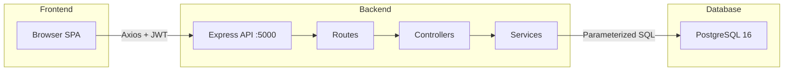

# Architecture

## Overview
Two-tier web application: React SPA frontend + Node.js/Express REST API backend backed by PostgreSQL.
Self-hosted, single-tenant. Any company can deploy within their own network.

## Components

### Frontend (port 5173)
- React 18 SPA with client-side routing
- Pages: Dashboard, Inventory, Tickets, Users, Reports, Settings, Login
- Services layer (axios wrappers) for all API calls
- `useAuth` hook manages token and user state from localStorage

### Backend (port 5000)
- Express 4 REST API with 4-layer pattern
- Middleware stack: Security Headers → CORS → JSON Parse → Auth → RBAC → Validation → Controller
- 7 route domains: auth, users, inventory, tickets, dashboard, reports, settings
- Shared PostgreSQL connection pool

### Database
- PostgreSQL 16 (migrating from MSSQL)
- 5 core tables: users, inventory, tickets, ticket_history, lookup_values
- Foreign keys enforce referential integrity
- UNIQUE constraints prevent duplicate serial/MAC

## Key Invariants
1. All writes go through services — never query directly from controllers
2. All queries are parameterized — no string concatenation
3. JWT required on every protected endpoint
4. RBAC enforced at route level via middleware
5. Asset ID generated server-side from SHA-256 hash
6. Ticket history records every state change immutably

## Diagram

