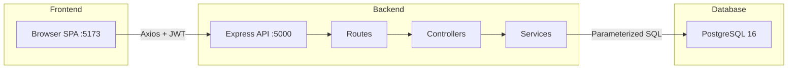

# Architecture

## Overview
Two-tier web application: React SPA frontend + Node.js/Express REST API backend backed by PostgreSQL.
Self-hosted, single-tenant. Any company can deploy within their own network.

## Components

### Frontend (port 5173)
- React 18 SPA with client-side routing via React Router 6
- Pages: Dashboard (`/`), Inventory (`/inventory`), Tickets (`/tickets`), Raise Ticket (`/raise-ticket`), Users (`/users`), Reports (`/reports`), Settings (`/settings`), Login (`/login`)
- Services layer (axios wrappers) for all API calls
- `useAuth` hook manages token and user state from localStorage
- `ProtectedRoute` component guards all pages except `/login`
- UI components: Button, Modal, Badge, Table, FormInput, Select, FormSection, AddDropdownItemModal

### Backend (port 5000)
- Express 4 REST API with 4-layer pattern: Route → Controller → Service → Database
- Middleware stack: Security Headers → CORS → JSON Parse → Auth (JWT) → RBAC → Validation → Controller
- 7 route domains: auth, users, inventory, tickets, dashboard, reports, settings
- 7 service modules: authService, userService, inventoryService, ticketService, dashboardService, reportsService, settingsService
- Shared PostgreSQL connection pool (`pg` v8.23)
- JWT secret from `process.env.JWT_SECRET` (set via `.env`)
- bcryptjs v3 for password hashing (10 rounds)

### Database
- PostgreSQL 16 (migrated from MSSQL)
- 5 core tables: `users`, `inventory`, `tickets`, `ticket_history`, `lookup_values`
- Foreign keys enforce referential integrity
- UNIQUE constraints prevent duplicate serial/MAC (partial indexes)
- CHECK constraints on `role`, `status`, `assigned_team` enums

## Middleware Stack

```
Request → Security Headers → CORS → express.json() → JWT Auth → RBAC → Validation → Controller
```

### auth.js — JWT Verification
- Extracts `Bearer <token>` from `Authorization` header
- Calls `jwt.verify(token, process.env.JWT_SECRET)`
- Sets `req.user = { id, email, role, name }` from payload
- Returns 401 on missing/invalid/expired token
- **Security note**: Does not verify `req.user.id` exists in the database — trusts the JWT role claim

### rbac.js — Role-Based Access Control
- `allowRoles(...roles)` returns middleware that checks `req.user.role` against allowed list
- Returns 403 with `{ error: "Forbidden" }` if role not permitted
- Applied at route level — every protected endpoint enforces both auth and rbac

### validate.js — Input Validation
- Uses express-validator for request body/query/schema validation
- Applied selectively on endpoints that require strict input checking

### errorHandler.js — Global Error Handling
- Catches errors from upstream middleware and routes
- Formats consistent JSON error responses

## Authentication & Authorization

### JWT Design
- **Algorithm**: HS256
- **Secret**: `process.env.JWT_SECRET` (set via `.env`, 128-char random hex)
- **Payload**: `{ id, email, role, name }` — minimal claims, no sensitive data
- **Expiry**: `process.env.JWT_EXPIRES_IN || '8h'`
- **Token format**: `Bearer <jwt>` in Authorization header
- Login endpoint: `POST /api/auth/login` returns `{ token, user }`

### Roles & Permission Matrix

| Role | Users CRUD | Inventory CRUD | Ticket CRUD | Dashboard | Reports | Settings |
|------|-----------|---------------|-------------|-----------|---------|----------|
| Admin | ✅ Full | ✅ Full | ✅ Full | ✅ | ✅ | ✅ |
| Help Desk | ❌ | ✅ View + Create/Edit/Delete | ✅ View + Create | ✅ | ✅ | ❌ |
| IT Team | ❌ | ❌ | ✅ View | ❌ | ❌ | ❌ |
| Network Team | ❌ | ✅ View | ✅ View | ❌ | ❌ | ❌ |
| Cybersecurity | ❌ | ✅ View | ✅ View | ❌ | ❌ | ❌ |

### RBAC Implementation
- All user management endpoints (`/api/users/*`) restricted to `Admin` only
- Inventory write endpoints (`POST`, `PUT`, `DELETE`) restricted to `Admin` + `Help Desk`
- Ticket creation restricted to `Admin` + `Help Desk`
- Dashboard and Reports restricted to `Admin` + `Help Desk` + `IT Team`
- Network Team and Cybersecurity have read-only access to inventory and tickets
- Settings fully Admin-only

## Service Layer

All business logic lives in `backend/services/`:

| Service | Lines | Key Functions |
|---------|-------|---------------|
| `authService.js` | 32 | `login(email, password)` → `{ token, user }` |
| `userService.js` | 161 | `createUser`, `editUser`, `editRole`, `updatePassword`, `setActive`, `listUsers`, `searchUsers` |
| `inventoryService.js` | 360 | `list`, `getById`, `create`, `update`, `delete`, `search`, `getDropdowns`, `addDropdownValue`, `searchUser` |
| `ticketService.js` | 258 | `createTicket`, `listTickets`, `getTicketById`, `updateStatus`, `assignTeam`, `transferTicket`, `addWorkNotes`, `deleteTicket`, `searchUsers` |
| `dashboardService.js` | 46 | `getStats` → `{ totalAssets, assignedAssets, availableAssets, inMaintenance, openTickets, recentAssets, recentTickets }` |
| `reportsService.js` | 77 | `getReports` → `{ assetsByStatus, assetsByMinistry, ticketsByTeam, ticketsByStatus, ticketTrend, totals, usersByRole }` |
| `settingsService.js` | 51 | `getSettings`, `updateNotifications` |

## Security Findings (from RBAC Audit, 2026-08-27)

| # | Severity | Finding | Status |
|---|----------|---------|--------|
| 3.1 | LOW | JWT expiry enforced server-side via `jwt.verify` | ✅ Working |
| 3.2 | LOW | No refresh token mechanism — 8h single JWT | Informational |
| 3.3 | MEDIUM | No rate limiting on `/api/auth/login` | ⚠️ Gap |
| 3.4 | LOW | Admin-only endpoints well constrained | ✅ Verified |
| 3.5 | LOW | No cross-role data isolation on shared read endpoints | ⚠️ Design decision |
| 3.6 | MEDIUM | Network Team/Cybersecurity cannot access Dashboard or Reports | ⚠️ May be oversight |
| 3.7 | LOW | Settings fully Admin-only | ✅ Correct |
| 3.8 | LOW | No audit trail for RBAC 403 violations | Informational |
| 3.9 | INFO | Password hashing: bcryptjs 10 rounds | ✅ Secure |
| 3.10 | INFO | No SQL injection — all queries parameterized | ✅ Secure |
| 3.11 | MEDIUM | JWT role claim trusted without DB user verification | ⚠️ Gap |

Full audit: `docs/security/RBAC_AUDIT.md`
Test coverage: `tests/integration/rbac-audit.test.js` (94 tests, all passing)

## Key Invariants
1. All writes go through services — never query directly from controllers
2. All queries are parameterized — no string concatenation (`$1`, `$2` positional params)
3. JWT required on every protected endpoint
4. RBAC enforced at route level via `allowRoles()` middleware
5. Asset ID generated server-side from SHA-256 hash of (serial_number \|\| mac_address)
6. Ticket history records every state change immutably (action, from_team, to_team, note, performed_by, timestamp)
7. Delete order: ticket_history before tickets (FK constraint: `ticket_history_ticket_id_fkey`)
8. Integer columns from `COUNT(*)` parsed with `parseInt()` to avoid string comparison bugs

## Diagram


