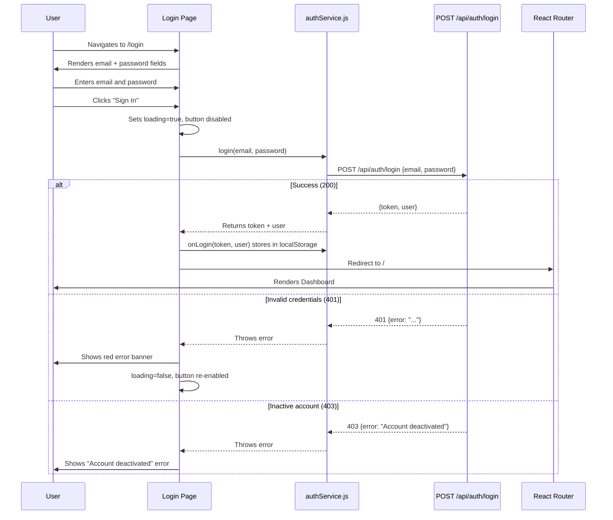
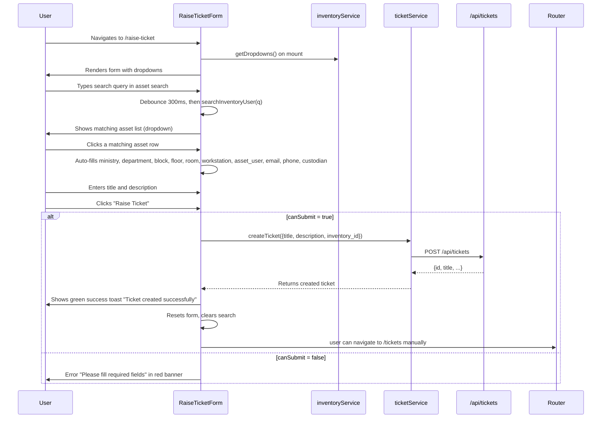
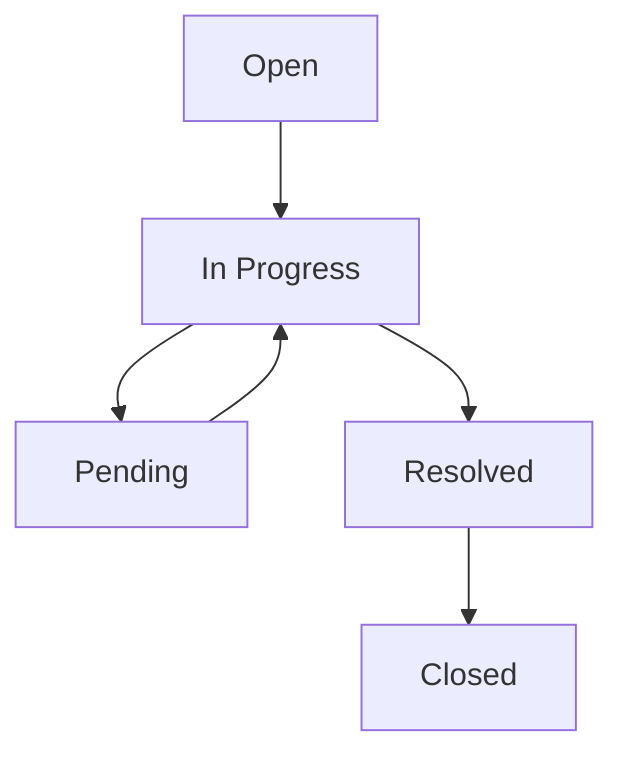
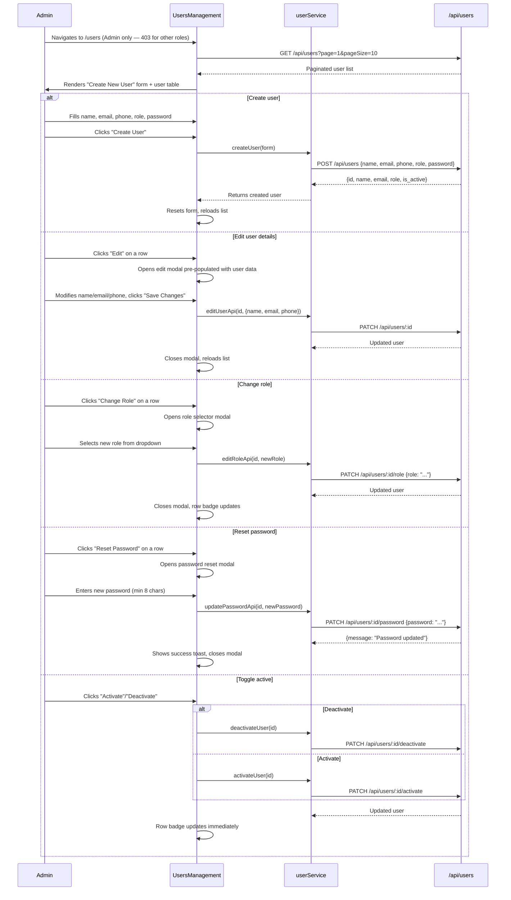
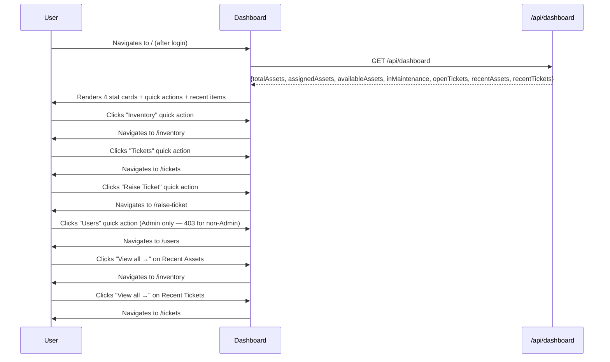
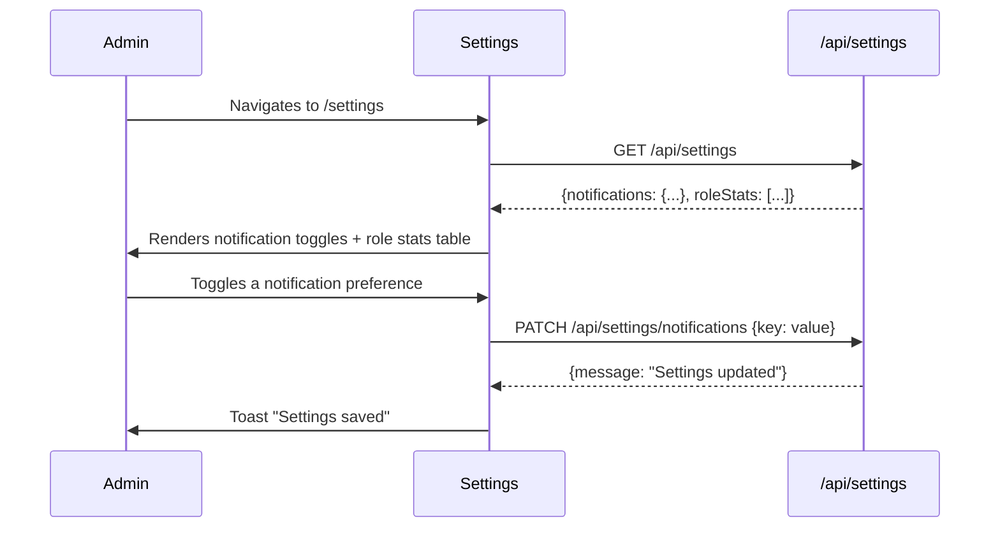
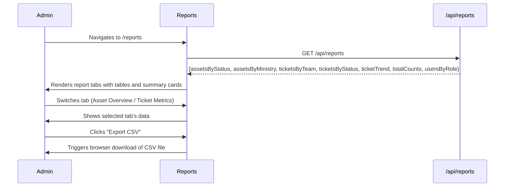

# User Flows — Version 2.0

> **Updated:** 2026-08-27 · Day 8 — RBAC Audit & Documentation Sync
> **Previous version:** 1.1 (2026-08-25, Day 3)
> **Changes:** Added RBAC permission context to all flows; expanded Flow 5 with role-change, password-reset, and activate/deactivate endpoints; verified all 8 flows against actual route definitions.

## RBAC Quick Reference

All flows assume the user is authenticated (valid JWT in `Authorization: Bearer <token>`). The role determines what operations are available:

| Role | Users (CRUD) | Inventory (Write) | Tickets (Write) | Dashboard | Reports | Settings |
|------|-------------|-------------------|-----------------|-----------|---------|----------|
| Admin | ✅ All | ✅ All | ✅ All | ✅ | ✅ | ✅ |
| Help Desk | ❌ | ✅ Create/Edit/Delete | ✅ Create | ✅ | ✅ | ❌ |
| IT Team | ❌ | ❌ | ✅ Status/Notes | ❌ | ❌ | ❌ |
| Network Team | ❌ | ❌ (read-only) | ✅ Status/Notes | ❌ | ❌ | ❌ |
| Cybersecurity | ❌ | ❌ (read-only) | ✅ Status/Notes | ❌ | ❌ | ❌ |

- **401** = missing/invalid JWT token
- **403** = valid token but role not permitted for this endpoint
- Full matrix: `docs/ARCHITECTURE.md` §3 · Audit: `docs/security/RBAC_AUDIT.md`

---

## Flow 1: Login



### Step-by-Step UI Interactions

| Step | Action | UI Behaviour |
|------|--------|-------------|
| 1 | Navigate to `/login` | Page renders with email input, password input, Sign In button, footer text |
| 2 | Enter email | Input validates as email format on blur (HTML5 `type="email"`) |
| 3 | Enter password | Input accepts any string; no client-side length check |
| 4 | Click "Sign In" | Button text changes to "Signing in…", button becomes disabled |
| 5 | Submit to API | POST `/api/auth/login` with `{email, password}` |
| 6 | Success | Token + user stored in localStorage; navigates to `/` (Dashboard) |
| 7 | Auth failure | Red error banner appears below password field; button re-enabled |
| 8 | Inactive account | Error banner shows "Account deactivated"; button re-enabled |

### Validation Rules
- **Email:** required, HTML5 email format
- **Password:** required, no minimum length enforced client-side
- **On blur:** HTML5 native validation only (no custom blur handlers)

### Error States
| Condition | Display |
|-----------|---------|
| Network error | "Login failed" error banner |
| 401 unauthorized | Response error message from backend |
| 403 forbidden | "Account deactivated" or response error |
| Loading | Button shows "Signing in…" and is disabled |

---

## Flow 2: Raise a Ticket



### Step-by-Step UI Interactions

| Step | Action | UI Behaviour |
|------|--------|-------------|
| 1 | Navigate to `/raise-ticket` | Page renders with search box, ticket details form |
| 2 | Type in search box | After 300ms debounce, calls `searchInventoryUser(q)` |
| 3 | Results appear | Dropdown list of matching assets (up to 10) shown below search |
| 4 | Click a result | Form auto-fills: ministry, department, block_name, floor, room, workstation, asset_user, email, phone, custodian |
| 5 | Fill title | Text input, required, no character limit shown |
| 6 | Fill description | Textarea, required, no character limit shown |
| 7 | Click "Raise Ticket" | Button disabled during submit; shows loading state |
| 8 | Success | Green toast "Ticket created successfully"; form resets |
| 9 | Validation failure | Red alert "Please fill required fields" |

### Form Field Validations
| Field | Required | Validation |
|-------|----------|-----------|
| title | ✅ | Non-empty |
| description | ✅ | Non-empty |
| asset_user | ✅ | Non-empty (required by `canSubmit`) |
| email | ✅ | Non-empty (required by `canSubmit`) |
| inventory_id | ❌ | Optional; sets ticket association |

### Loading States
- Asset search: no explicit spinner; results appear when API responds
- Submit button: `disabled={!canSubmit}` while loading; text hidden (native button state)

---

## Flow 3: Resolve a Ticket

```mermaid
sequenceDiagram
    participant User as Team Member
    participant ListUI as TicketsList
    participant TktSvc as ticketService
    participant API as /api/tickets

    User->>ListUI: Navigates to /tickets
    ListUI->>API: GET /api/tickets?page=1&pageSize=10
    API-->>ListUI: Paginated ticket list
    ListUI->>User: Renders table with status, team, actions
    User->>ListUI: Selects status filter "In Progress"
    ListUI->>API: GET with status=In Progress
    API-->>ListUI: Filtered results
    User->>ListUI: Clicks "Detail" on a ticket
    ListUI->>API: GET /api/tickets/:id
    API-->>ListUI: Ticket detail + work notes
    ListUI->>User: Opens detail modal
    User->>ListUI: Clicks "Start" button
    ListUI->>TktSvc: updateTicketStatus(id, "In Progress")
    TktSvc->>API: PATCH /api/tickets/:id/status
    API-->>TktSvc: Updated ticket
    ListUI->>User: Row status badge updates to "In Progress"
    User->>ListUI: Types note in work note input, clicks Submit
    ListUI->>TktSvc: addTicketWorkNotes(id, note)
    TktSvc->>API: POST /api/tickets/:id/notes
    API-->>TktSvc: {message, ticket}
    ListUI->>User: Note input clears; row updates
    User->>ListUI: Clicks transfer button "To IT"
    ListUI->>TktSvc: transferTicket({ticketId, toTeam, note})
    TktSvc->>API: PUT /api/tickets/transfer
    API-->>TktSvc: Updated ticket
    ListUI->>User: Row team badge updates to "IT Team"
```

### Step-by-Step UI Interactions

| Step | Action | UI Behaviour |
|------|--------|-------------|
| 1 | Navigate to `/tickets` | Loads all tickets with pagination (10 per page) |
| 2 | Select status filter | Drops down All / Open / In Progress / Pending / Resolved / Closed |
| 3 | Select team filter | Drops down All / IT Help Desk / IT Team / Network Team / Cybersecurity Team |
| 4 | Click "Detail" | Opens modal with ticket info (title, status, team, description, work notes) |
| 5 | Click "Start" | Patches status to "In Progress"; row updates immediately |
| 6 | Click "Close" | Patches status to "Closed"; row updates immediately |
| 7 | Click "To IT / To Net / To Cyber" | Transfers ticket to specified team; row updates immediately |
| 8 | Click "Note" | Shows inline input row; Enter key or Submit button sends note |
| 9 | Submit note | Input row disappears; ticket detail reloads |

### Status Flow (Configurable in v2)


### Error States
| Condition | Display |
|-----------|---------|
| API error on status update | Red alert banner at top of page |
| API error on transfer | Red alert banner at top of page |
| API error on work note | Red alert banner at top of page |
| No tickets match filters | Empty state: "No tickets found. Raise a new ticket or adjust filters." |

---

## Flow 4: Add an Asset

```mermaid
sequenceDiagram
    participant User as Admin / Help Desk
    participant InvUI as InventoryManagement
    participant InvSvc as inventoryService
    participant API as /api/inventory

    User->>InvUI: Navigates to /inventory
    InvUI->>API: GET /api/inventory + GET /api/inventory/dropdowns
    API-->>InvUI: Assets + dropdown options
    InvUI->>User: Renders table with search, filters, "Add Asset" button
    User->>InvUI: Clicks "Add Asset"
    InvUI->>User: Opens modal with 6-section form
    User->>InvUI: Selects Ministry from dropdown
    InvUI->>InvUI: Auto-sets MDO Location (if ministry has mapping)
    InvUI->>InvUI: Resets Department dropdown options
    User->>InvUI: Selects Department
    InvUI->>InvUI: Auto-sets MDO Location (if department has mapping)
    User->>InvUI: Selects Asset Category
    User->>InvUI: Enters Serial Number or MAC Address
    Note right of User: At least one required to generate Asset ID
    User->>InvUI: Fills all required fields (marked with *)
    User->>InvUI: Clicks "Save Asset"
    InvUI->>InvUI: Validates form (required fields, IP/MAC format, date logic)
    alt Validation passes
        InvUI->>InvSvc: addInventory(form)
        InvSvc->>API: POST /api/inventory
        alt Duplicate serial/MAC
            API-->>InvSvc: 200 {existing: true, asset}
            InvSvc-->>InvUI: Returns existing asset
            InvUI->>User: Toast "Asset already exists — loaded existing record"
        alt New asset
            API-->>InvSvc: 201 {asset, asset_id, sr_no}
            InvSvc-->>InvUI: Returns new asset
            InvUI->>User: Toast "Asset added successfully"
            InvUI->>InvUI: Closes modal, resets form, reloads list
        else Validation fails
            InvUI->>User: Shows field-level errors in red below each field
            InvUI->>User: Red alert "Please fix validation errors before saving"
        end
    end
```

### Section-by-Section UI Details

**Section 1: Basic Information**
| Field | Control | Required | Validation |
|-------|---------|----------|-----------|
| Sr. No. | Read-only text | — | Auto-assigned by backend |
| Ministry | Dropdown + "Add New" option | ✅ | Required; triggers MDO auto-fill |
| Department | Dropdown + "Add New" option | ✅ | Required; resets when ministry changes |
| MDO Location | Text input | ❌ | Auto-filled from ministry/department mapping |
| Division | Text input | ❌ | Free text |
| Asset ID | Read-only text | — | Auto-generated by backend |
| Serial Number | Text input | ❌* | *Required if MAC not provided |
| Asset Category | Dropdown + "Add New" option | ✅ | Required; shows "Other" sub-field if "Other" selected |

**Section 2: Asset Location** (block_name, floor, room, workstation) — all text, no required flag.

**Section 3: Asset Details**
| Field | Control | Required | Validation |
|-------|---------|----------|-----------|
| Asset Description | Text input | ✅ | Required |
| Make / Brand / Model | Text input | ❌ | Free text |
| Purchase Date | Date input | ❌ | Must be ≤ End of Life Date |
| Operating System | Dropdown + "Add New" option | ❌ | Shows "Other" sub-field if "Other" selected |
| IP Address | Text input | ❌ | Regex: `\d{1,3}.\d{1,3}.\d{1,3}.\d{1,3}` |
| MAC Address | Text input | ❌* | Regex: `XX:XX:XX:XX:XX:XX` or `XX-XX-XX-XX-XX-XX` |
| Network Connection Type | Dropdown | ❌ | Ethernet / WiFi / Both / None |

**Section 4: Security & Management**
- EDR Installed: Yes/No dropdown; if "No", reason field appears (text input)
- UEM Installed: Yes/No dropdown; if "No", reason field appears (text input)

**Section 5: Ownership & Assignment**
| Field | Control | Required |
|-------|---------|----------|
| Asset User | Text input | ✅ |
| Asset Custodian | Text input | ✅ |
| Asset Current Status | Dropdown (Active/Inactive/In Repair/Disposed/Lost) | ✅ |

**Section 6: Lifecycle & Support**
| Field | Control | Required |
|-------|---------|----------|
| Installation Date | Date input | ❌ |
| Date of Removal | Date input | ❌ |
| End of Support Date | Date input | ❌ |
| End of Life Date | Date input | ❌ |
| AMC / Warranty | Dropdown (AMC/Warranty/None) | ❌ |
| A/W Expiry Date | Date input | ❌ (must be ≥ Purchase Date) |
| Critical | Dropdown (Yes/No) | ❌ |
| Remarks | Textarea | ❌ |

### Dropdown "Add New" Behaviour
When a user selects `+ Add New <Field>` from any dropdown:
1. `AddDropdownItemModal` opens with the field label pre-filled
2. User types a new value and clicks "Save"
3. Backend `POST /api/inventory/dropdowns` stores the value
4. The dropdown options refresh and the new value is auto-selected

### Error States
| Condition | Display |
|-----------|---------|
| Validation error (single field) | Red text below the specific field |
| Validation error (cross-field: no serial/MAC) | Red text on both serial_number and mac_address fields |
| Duplicate asset | Green toast "Asset already exists — loaded existing record" |
| API failure | Red alert banner "Unable to save asset" |
| Loading during save | "Save Asset" button disabled, text changes to "Saving…" |

---

## Flow 5: Manage Users



### API Endpoints Used

| Operation | Method | Endpoint | RBAC |
|-----------|--------|----------|------|
| List users | GET | `/api/users` | Admin only |
| Create user | POST | `/api/users` | Admin only |
| Edit user | PATCH | `/api/users/:id` | Admin only |
| Change role | PATCH | `/api/users/:id/role` | Admin only |
| Reset password | PATCH | `/api/users/:id/password` | Admin only |
| Activate | PATCH | `/api/users/:id/activate` | Admin only |
| Deactivate | PATCH | `/api/users/:id/deactivate` | Admin only |
| Search users | GET | `/api/users/search?q=...` | All authenticated roles |

### Step-by-Step UI Interactions

**Create User (inline form at top of page):**
| Step | Action | UI Behaviour |
|------|--------|-------------|
| 1 | Enter name | Text input, `required` |
| 2 | Enter email | Email input, `required`, HTML5 email validation on blur |
| 3 | Enter phone | Text input, optional |
| 4 | Select role | Dropdown: Admin / Help Desk / IT Team / Network Team / Cybersecurity |
| 5 | Enter password | Password input, `required`, `minLength=8`, hidden characters |
| 6 | Click "Create User" | Button disabled during submit; green toast on success, red error on failure |

**Edit User (modal):**
| Step | Action | UI Behaviour |
|------|--------|-------------|
| 1 | Click "Edit" on row | Modal opens with pre-populated fields (name, email, phone, role) |
| 2 | Modify fields | Changes reflected in real-time |
| 3 | Click "Save Changes" | Button shows "Saving…" while loading; modal closes on success |
| 4 | Click "Cancel" or X | Modal closes without saving |

**Activate / Deactivate:**
| Step | Action | UI Behaviour |
|------|--------|-------------|
| 1 | Click "Activate" or "Deactivate" | Icon toggles immediately; row badge updates |
| 2 | API response | No toast shown; list reloads in background |

### Validation Rules
- **Name:** required, non-empty
- **Email:** required, valid email format
- **Password:** required on create, min 8 characters (client-side; server also validates)
- **Role:** required on create, must be one of: Admin / Help Desk / IT Team / Network Team / Cybersecurity
- **Activate/Deactivate:** Admin only; no body required (path-based)

---

## Flow 6: Dashboard Overview



### UI Details

| Element | Behaviour |
|---------|-----------|
| RBAC | Admin / Help Desk / IT Team only; 403 for Network Team and Cybersecurity |
| Loading state | 4 placeholder stat-card skeletons shown while API loads |
| Stat cards | 4 cards: Total Assets, Available, Assigned, Open Tickets; each shows trend label and sparkline |
| Quick actions | 4 action cards with icons; click navigates to the corresponding page |
| Recent Assets table | Shows up to 5 most recent assets with ID, description, user, location, status badge |
| Recent Tickets list | Shows up to 5 most recent tickets with title, creator name, status badge |
| Status pill | "System Operational" with pulse dot; shows total asset count |

---

## Flow 7: Configure Dropdown Lookups *(New — Settings)*



### UI Details
| Element | Behaviour |
|---------|-----------|
| Notification toggles | Switch-style toggle for each notification type; auto-saves on change |
| Role stats table | Shows count of users per role (read-only) |
| Save feedback | Success toast on notification update; error banner on failure |

---

## Flow 8: View Reports *(New)*



### RBAC
Admin / Help Desk / IT Team only; 403 for Network Team and Cybersecurity.

### UI Details
| Element | Behaviour |
|---------|-----------|
| Tab navigation | Two tabs: "Asset Overview" and "Ticket Metrics" |
| Asset Overview tab | Table: assets by status, by ministry (top 10), by category |
| Ticket Metrics tab | Table: tickets by team, by status, trend over last 30 days |
| Export CSV | Generates and downloads CSV from current tab data |
